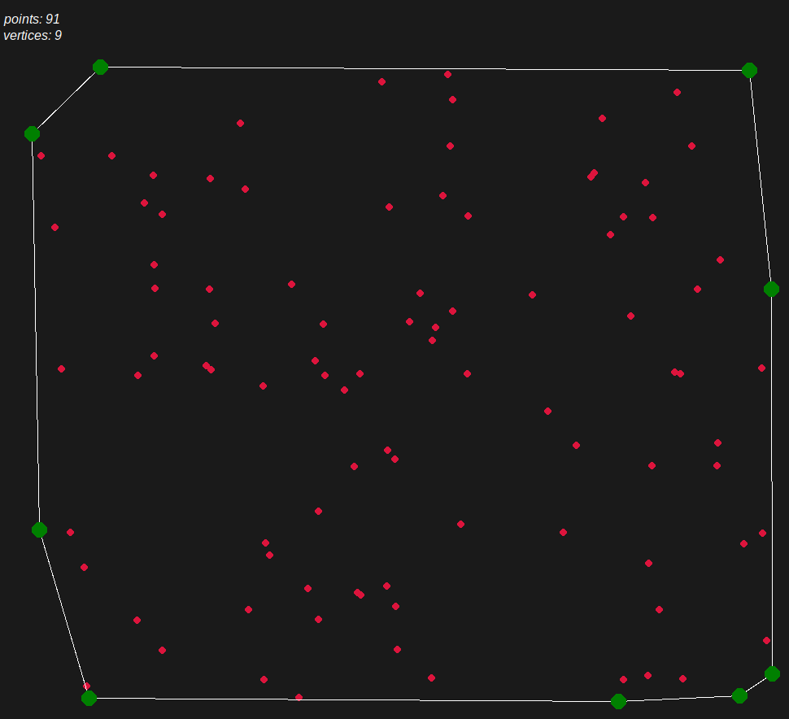

# GIFT WRAPPING ALGORITHM

My implementation of the Gift Wrapping Algorithm.

# How to run:
The Python script needs the Turtle Graphics library to work.
On Ubuntu it can be installed with:
<pre><code>sudo apt install python3-tk</pre></code>

Compile the program with the makefile:
<pre><code>make gift_wrapping</pre></code>

Run the program:
<pre><code>./gift_wrapping.out</pre></code>

# Example Result:
